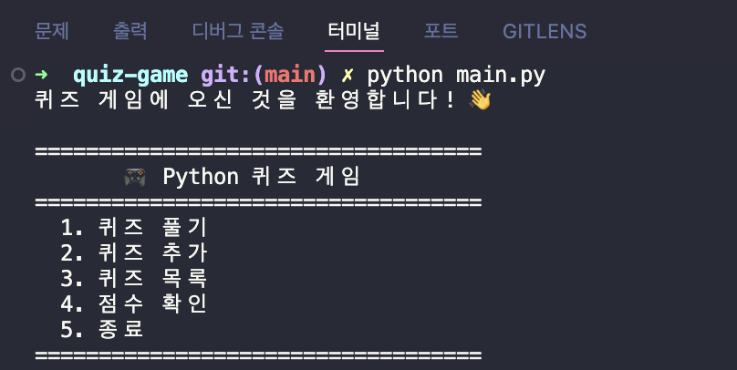
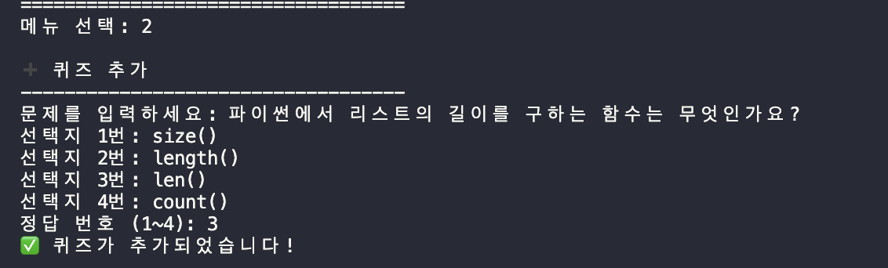
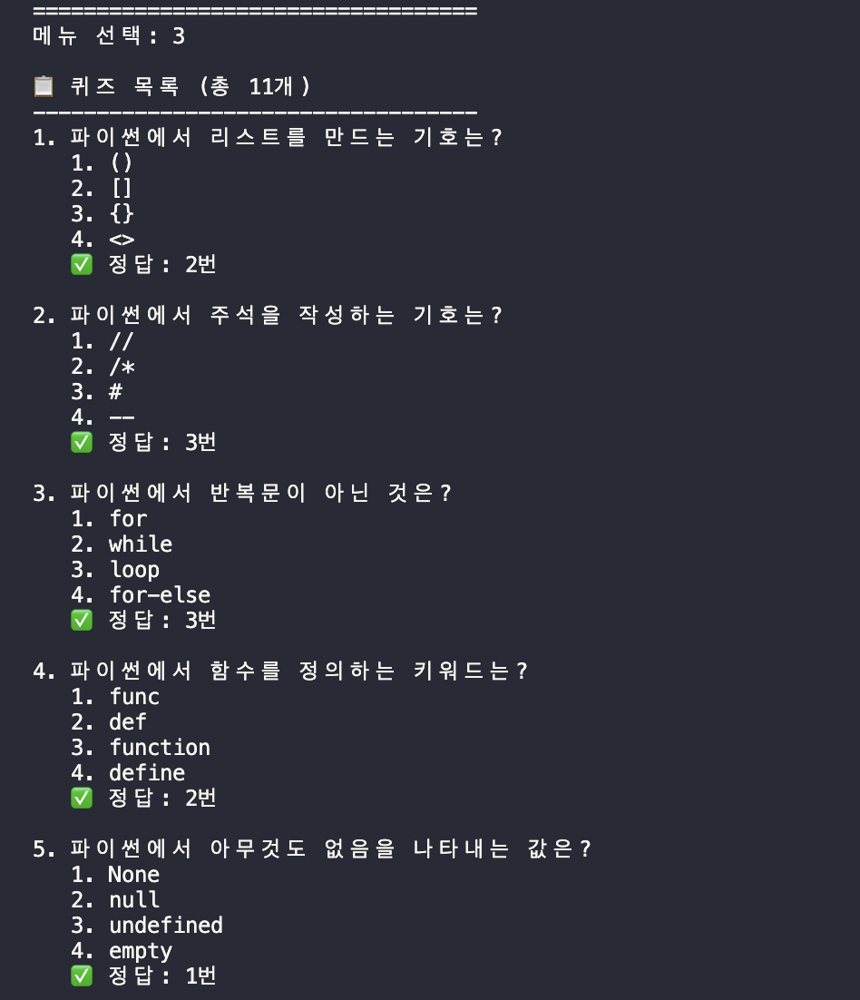
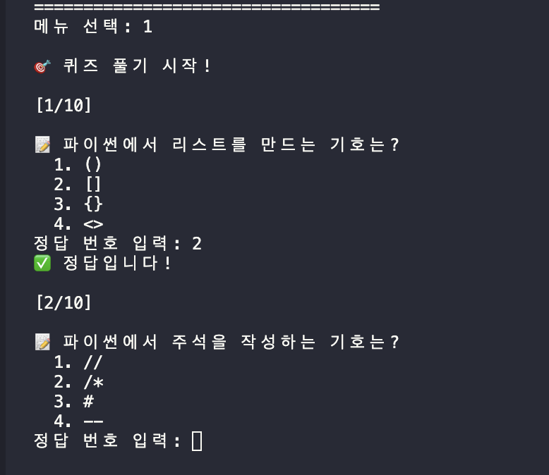
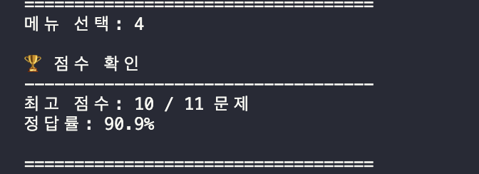
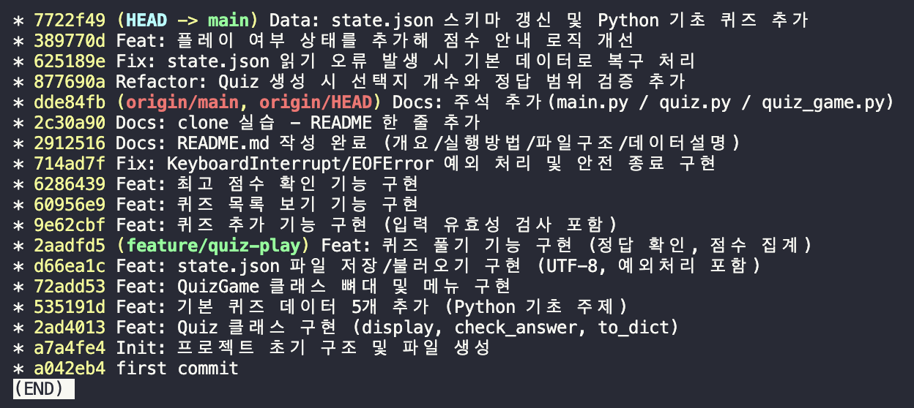

# 🎮 Python 퀴즈 게임

## 1. 프로젝트 개요

터미널에서 동작하는 Python 기반 퀴즈 게임입니다.<br>
퀴즈 풀이, 추가, 목록 확인, 점수 관리 기능을 제공하며 JSON 파일로 데이터를 저장하여 프로그램 재실행 후에도 상태를 유지합니다.

---

## 2. 퀴즈 주제 선정 이유

Python 기초 문법을 주제로 선정했습니다.<br>
단순 암기가 아니라 문제를 만들고 풀어보는 과정에서 학습 내용을 반복하고 이해도를 높이기 위함입니다.

---

## 3. 실행 방법

```bash
python main.py
```

* Python 3.10 이상 필요

---

## 4. 기능 목록

| 기능    | 설명                    |
| ----- | --------------------- |
| 퀴즈 풀기 | 저장된 퀴즈를 순서대로 풀고 결과 확인 |
| 퀴즈 추가 | 문제/선택지 4개/정답 입력       |
| 퀴즈 목록 | 전체 퀴즈 확인              |
| 점수 확인 | 최고 점수 및 정답률 확인        |
| 종료    | 데이터 저장 후 종료           |

---

## 5. 파일 구조

```
프로젝트/
├── main.py           # 프로그램 진입점
├── quiz.py           # Quiz 클래스
├── quiz_game.py      # QuizGame 클래스
├── state.json        # 데이터 저장 파일
├── README.md
└── docs/
    └── screenshots/  # 실행 화면 및 증빙 자료
```

---

## 6. 데이터 파일 설명 (state.json)

* 위치: 프로젝트 루트
* 인코딩: UTF-8
* 역할: 퀴즈 목록 + 최고 점수 + 플레이 여부 저장

```json
{
  "quizzes": [
    {
      "question": "문제 내용",
      "choices": [
        "선택1",
        "선택2",
        "선택3",
        "선택4"
      ],
      "answer": 1
    }
  ],
  "best_score": 3,
  "has_played": true
}
```

---

## 7. 실행 화면 및 증빙 자료

### 7-1. 개발 환경

#### Python 버전

```bash
$ python --version
Python 3.12.13
```

#### Git 설정

```bash
$ git config --list
user.name=cmh
user.email=***@gmail.com
core.repositoryformatversion=0
core.filemode=true
credential.helper=osxkeychain
remote.origin.url=git@github.com:ChoMyeongHwan/python-console-quiz-game.git
```

---

### 7-2. 프로그램 실행

#### 메인 메뉴



#### 퀴즈 추가



#### 퀴즈 목록



#### 퀴즈 풀기



#### 점수 확인



---

### 7-3. Git 작업 이력

```zsh
git log --oneline --graph
```



---

## 8. 주요 학습 내용

### Python 기초

* 변수와 자료형 (int, str, bool, list, dict)
* 조건문 (if/elif/else)
* 반복문 (for, while)
* 함수 (매개변수, 반환값)

### 객체지향

* Quiz / QuizGame 클래스 설계
* 속성과 메서드 분리

### 파일 입출력

* JSON 파일 저장/불러오기
* 데이터 영속성 구현

### 예외 처리

* 입력값 검증
* 파일 오류 처리
* Ctrl+C 종료 처리

### Git

* 기능 단위 커밋
* 브랜치 사용 및 병합

---

## 9. 확장 가능 기능

* 랜덤 출제
* 문제 수 선택
* 퀴즈 삭제
* 점수 기록 히스토리
* 힌트 기능

---
